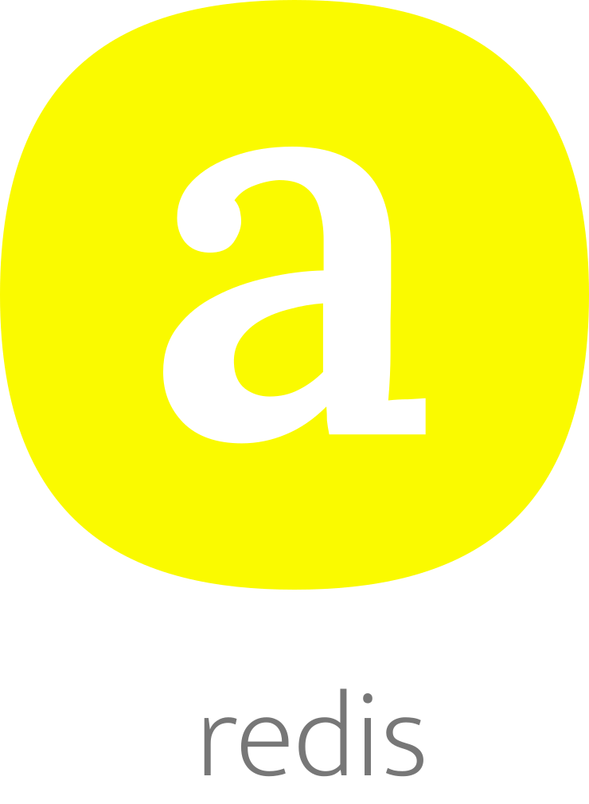

</br >
</br >

<p align='center'>
  <a target='_blank' rel='noopener noreferrer' href='#'>
    
  </a>
</p>

<h1 align='center'>onesy Redis</h1>

<p align='center'>
  Redis
</p>

<br />

<h3 align='center'>
  <sub>MIT license&nbsp;&nbsp;&nbsp;&nbsp;</sub>
  <sub>Production ready&nbsp;&nbsp;&nbsp;&nbsp;</sub>
  <sub>100% test cov&nbsp;&nbsp;&nbsp;&nbsp;</sub>
  <sub>Nodejs</sub>
</h3>

<p align='center'>
    <sub>Very simple code&nbsp;&nbsp;&nbsp;&nbsp;</sub>
    <sub>Modern code&nbsp;&nbsp;&nbsp;&nbsp;</sub>
    <sub>Junior friendly&nbsp;&nbsp;&nbsp;&nbsp;</sub>
    <sub>Typescript&nbsp;&nbsp;&nbsp;&nbsp;</sub>
    <sub>Made with :yellow_heart:</sub>
</p>

<br />

## Getting started

### Add

```sh
  yarn add @onesy/redis
```

Add `redis` peer dependency.

```sh
  yarn add redis
```

### Use

```javascript
  import OnesyRedis from '@onesy/redis';
  // Make if you wanna a config file and
  // inside of it add all the process.env related props
  import Config from './config';

  // Make a new amqp instance
  const onesyRedis = new OnesyRedis({
    uri: Config.amqp.redis.uri
  });

  // Await for a client connection
  await onesyRedis.client;

  // Send to a queue
  await onesyRedis.publish('a', 'a'); 
```

### Dev


Install

```sh
  yarn
```

Test

```sh
  yarn test
```

One time local setup

Install docker and docker-compose

  - https://docs.docker.com/get-docker
  - https://docs.docker.com/compose/install

Make docker containers

```sh
  yarn docker
```

### Prod

Build

```sh
  yarn build
```
